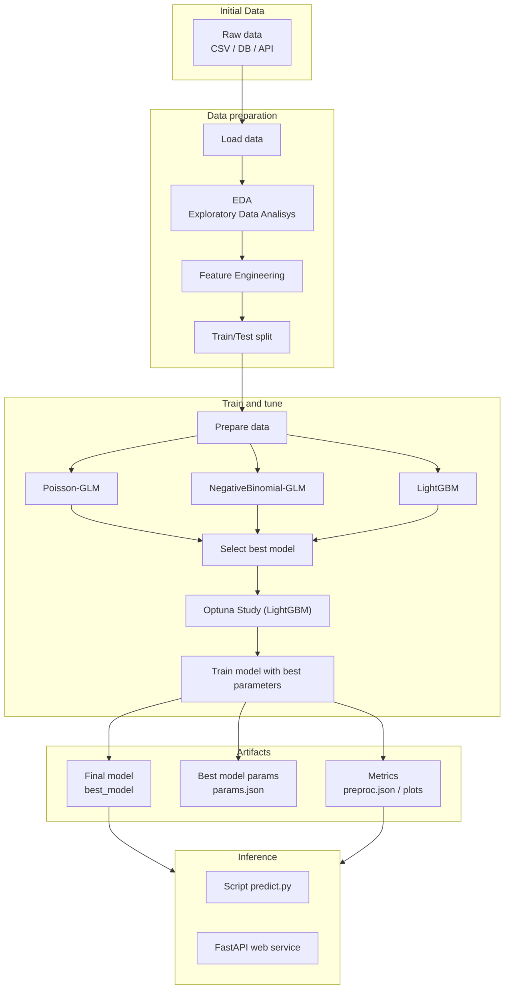

# Berlin Bicycle Thefts Prediction

This project is midterm assignment for [Machine Learning Zoomcamp 2025](https://datatalks.club/blog/machine-learning-zoomcamp.html)

## Problem


Bicycles are prety widely used in Berlin. And, like any other big city, the problem if its theft is acute.

Tens of thousands cases are reported annualy, with very low resolution rates, which basically makes Berlin [Germany's bike theft capital](https://biketheft.gustav.uber.space/#:~:text=German%20Bike%20Theft%20City,Bike%20Theft%20Season)

Is it possible though to predict number of thefts for particular date? Let us find out!

## Objective

The goal of this project is to forecast daily bicycle thefts in Berlin at the LOR ([Lebensweltlich orientierte Räume](https://www.berlin.de/sen/sbw/stadtdaten/stadtwissen/sozialraumorientierte-planungsgrundlagen/lebensweltlich-orientierte-raeume/) - Life-world oriented spaces) area level. 

The target is a non-negative count with many zeros and strong seasonality. Forecasts are consumed by a lightweight API that returns predicted counts for a given (lor, date) set.

## Why this matters

* Helps prioritize prevention and communication.
* Enables staffing and patrol planning with a short-term outlook.
* Produces interpretable drivers (seasonality, weather, events).

## Datasets

* [Fahrraddiebstahl in Berlin](https://daten.berlin.de/datensaetze/fahrraddiebstahl-in-berlin) - Main information about thefts
* [Lebensweltlich orientierte Räume (LOR) - Planungsräume (seit 2021)](https://daten.odis-berlin.de/de/dataset/lor_planungsgraeume_2021/?utm_source=chatgpt.com) - LOR maps
* [open-meteo.com](https://open-meteo.com/) - for weather information
* [Einwohnerinnen und Einwohner in Berlin in LOR-Planungsräumen am 31.12.2024](https://daten.berlin.de/datensaetze/einwohnerinnen-und-einwohner-in-berlin-in-lor-planungsraumen-am-31-12-2024?utm_source=chatgpt.com) - population per LOR
* [Overpass API](https://wiki.openstreetmap.org/wiki/Overpass_API) - for traffic density


## [Interactive map](https://vsokoltsov.github.io/berlin-bicycle-thefts/reports/eda_thefts_per_lor_map.html)

## Project's diagramm



## Model selection

* [GLM Poisson](https://www.statsmodels.org/stable/generated/statsmodels.genmod.families.family.Poisson.html#statsmodels.genmod.families.family.Poisson)
* [Negative Binomial](https://www.statsmodels.org/stable/generated/statsmodels.genmod.families.family.NegativeBinomial.html)
* [LightGBM](https://lightgbm.readthedocs.io/en/stable/)
  * trained on rate per 1,000 to capture non-linearities and interactions while preserving count behavior

### Why these models?

The target in this project is a **non-negative count** (events per time interval and location). Such data are discrete, right-skewed, and typically have variance that increases with the mean. Generalized linear models (GLMs) for count data (Poisson, Negative Binomial) are designed specifically for this situation, while generic regressors in scikit-learn treat the target as a continuous real-valued variable.

**Why not LinearRegression?**

`sklearn.linear_model.LinearRegression` implements ordinary least squares (OLS) and assumes a linear relationship with **constant variance** errors and a real-valued target ([scikit-learn docs](https://scikit-learn.org/stable/modules/generated/sklearn.linear_model.LinearRegression.html), [linear models overview](https://scikit-learn.org/stable/modules/linear_model.html)). OLS does not respect key properties of count data:

* It can produce **negative predictions**, which are meaningless for counts.
* It optimizes mean squared error under a homoscedastic Gaussian error model, while count data are discrete and often overdispersed ([Poisson regression overview](https://en.wikipedia.org/wiki/Poisson_regression)).  
* It does not naturally handle **exposure / offset** terms, which are standard when modeling event rates per unit time, distance, or population ([Poisson regression: offset and exposure](https://en.wikipedia.org/wiki/Poisson_regression#%22Exposure%22_and_offset)).

In contrast, Poisson and Negative Binomial GLMs explicitly model the conditional mean of a count or rate with a log link and a likelihood appropriate for non-negative integers ([statsmodels GLM docs](https://www.statsmodels.org/stable/glm.html), [Poisson family](https://www.statsmodels.org/stable/generated/statsmodels.genmod.families.family.Poisson.html), [Negative Binomial family](https://www.statsmodels.org/stable/generated/statsmodels.genmod.families.family.NegativeBinomial.html)).

**Why not DecisionTreeRegressor / RandomForestRegressor?**

`DecisionTreeRegressor` and `RandomForestRegressor` treat the target as continuous and typically minimize MSE or a similar variance-based impurity measure ([DecisionTreeRegressor docs](https://scikit-learn.org/stable/modules/generated/sklearn.tree.DecisionTreeRegressor.html), [RandomForestRegressor docs](https://scikit-learn.org/stable/modules/generated/sklearn.ensemble.RandomForestRegressor.html)).

While they can be applied to count targets in practice, they have several drawbacks for this problem:

* The loss is not aligned with a **Poisson or Negative Binomial likelihood**, so the models ignore the typical mean–variance relationship of count data.
* They can still produce **negative predictions** unless explicitly clipped.
* They offer no native notion of **offset / exposure** (events per hour, per 1,000 customers, etc.), which is natural in GLMs.
* They provide limited interpretability compared to GLMs, where coefficients can be directly interpreted as multiplicative effects on the expected rate.

In this project, Poisson and Negative Binomial GLMs serve as statistically well-founded **reference models** for counts, and adding another generic tree ensemble that optimizes MSE would not change the modeling story much.

**Why not XGBRegressor (XGBoost)?**

XGBoost’s `XGBRegressor` is a powerful gradient-boosted tree model for tabular regression ([XGBoost documentation](https://xgboost.readthedocs.io/en/stable/), [original XGBoost paper](https://arxiv.org/abs/1603.02754)). Conceptually, it plays a very similar role to LightGBM:

* Both libraries implement **gradient boosting of decision trees** for regression and classification.
* Both are designed for efficiency and strong performance on structured tabular data.

To avoid redundancy, I keep **one** boosted tree model in the model zoo, and use **LightGBM** for that role:

* LightGBM is specifically optimized for speed and memory usage on large, high-dimensional tabular datasets, using histogram-based splitting and leaf-wise tree growth ([LightGBM documentation](https://lightgbm.readthedocs.io/en/stable/)).  
* It supports objectives particularly suitable for **skewed and count-like targets**, such as Poisson and Tweedie losses, which are recommended in the LightGBM ecosystem for this type of data (see e.g. the LightGBM docs and talks on modeling counts / insurance claims with Tweedie loss).

Using both XGBRegressor and LightGBM would give two very similar gradient-boosted tree models, while the more important contrast here is:

* GLMs (Poisson / Negative Binomial): statistically interpretable count models with explicit likelihood.
* One strong non-linear tree-based model (LightGBM): to capture complex interactions and non-linearities beyond the GLMs.

**Summary**

* `LinearRegression`, `DecisionTreeRegressor`, `RandomForestRegressor`, and `XGBRegressor` are generic regressors that treat the target as a real-valued variable and typically minimize squared-error-type losses.
* For **count / rate data**, Poisson and Negative Binomial GLMs are a better statistical match: they ensure non-negative predictions, model the appropriate mean–variance structure, and naturally support offsets/exposures.
* LightGBM is chosen as a single, strong non-linear tree-based model to complement the GLMs, instead of maintaining multiple very similar ensembles (Random Forest, XGBoost, etc.).


## Evaluation metrics

* [Mean absolute error](https://scikit-learn.org/stable/modules/model_evaluation.html#mean-absolute-error)
* [Mean squared error](https://scikit-learn.org/stable/modules/model_evaluation.html#mean-squared-error)

## Project sturcture

* Inspired by [Cookiecutter Data Science](https://cookiecutter-data-science.drivendata.org/)

```
├── bicycle_theft                  <- Source code for use in this project.
│   ├── __init__.py
│   ├── api.py                     <- FastAPI web server
│   ├── config.py                  <- Store useful variables and configuration
│   ├── dataset.py                 <- Scripts to download or generate data
│   ├── features.py                <- Code to create features for modeling
│   ├── models.py                  <- API models
│   ├── predict.py                 <- CLI command for predictions
│   ├── predictor.py               <- Predictor class
│   └── train.py                   <- CLI command for model training
├── cloudbuild.yaml
├── data
│   ├── external                     <- Data from third party sources.
│   ├── interim                      <- Intermediate data that has been transformed.
│   ├── processed                    <- The final, canonical data sets for modeling.
│   └── raw                          <- The original data dump.
│       ├── Bicycle Theft Data.csv   <- Bicycle thefts data
│       └── population.csv           <- Population per LOr information
├── docker-compose.yaml              <- Run services locally
├── Dockerfile                       <- Building app in docker. Contains two images
├── docs                             <- Documentation for the datasets
│   ├── datensatzbeschreibung.pdf
│   └── EWR Datenpool Nov 2023.pdf
├── Makefile                         <- List of commands for running project
├── notebooks                        <- Jupyter notebooks
│   ├── 01_etl.ipynb                 <- Load data from all source
│   ├── 02_eda.ipynb                 <- Exploratory data analysis
│   ├── 03_feature_engineering.ipynb <- Feature Engineering
│   └── 04_train_model.ipynb         <- Model training
├── pyproject.toml                   <- Project settings and dependencies
├── README.md                        <- The top-level README for developers using this project.
├── reports                          <- Generated analysis as HTML, PDF, LaTeX, etc.
│   └── figures                      <- Generated graphics and figures to be used in reporting
└── uv.lock                          <- Dependencies lock
```

## API contract

### Get predictions

#### URL

`POST /bicycle_thefts/predict`
#### Request:

```json
{
  "items": [
        {
            "lor":"10100205",
            "date":"2025-11-14"
        },
        {
            "lor":"09200510",
            "date":"2025-11-14"
        }
    ]
}
```

Parameters:

* `lor` - ID of LOR
* `date` - YYYY-MM-DD (UTC, normalized); date for the prediction
  * Possible values are:
    * past date (limitation - `01.01.2024`, since main dataset has this limit)
    * future dates (today + 16 days; Due to open-meteo API limitations)

#### Response:

```json
{
  "items": [
    {
      "lor": "10100205",
      "date": "2025-11-14",
      "rate_hat_per_1000": 0.6238892076190875,
      "count_hat": 0.7617687225029058,
      "count_int": 1
    },
    {
      "lor": "09200510",
      "date": "2025-11-14",
      "rate_hat_per_1000": 0.09960964688015085,
      "count_hat": 0.7992678065663305,
      "count_int": 1
    }
  ]
}
```

Parameters:

* `lor`: 8-digit LOR code.
* `date`: YYYY-MM-DD (UTC, normalized).
* `rate_hat_per_1000`: expected daily thefts per 1,000 residents.
* `count_hat`: expected daily theft count (non-negative float).

## Deployment

* Platform: [Google Cloud Platform](https://cloud.google.com/free?hl=en)
* [FastAPI](https://fastapi.tiangolo.com/) (Swagger): [https://bike-thefts-api-17407986606.europe-west3.run.app](https://bike-thefts-api-17407986606.europe-west3.run.app/docs)

### How-to

1. [Install gcloud CLI](https://docs.cloud.google.com/sdk/docs/install)
2. Build docker image via

## Run project

### Jupyter Notebooks

#### Local

* `uv sync`
* Activate virtual environment via `source .venv/bin/activate`
* Create kernel via `make install-kernel`
* Select given kernel in Jupter Notebooks

#### Docker

* It is possible to run Jupyer Notebooks with [docker-compose](https://docs.docker.com/compose/): `make jupyter`

### API

#### Local

* `uv sync`
* Activate virtual environment via `source .venv/bin/activate`
* `python -m bicycle_theft.api --host 0.0.0.0 --port ${PORT:-8080}`

#### Docker

* `make api`

### CLI

* `make train` - trains model
* `make predict items='[{"lor":"10100205","date":"2025-11-20"},{"lor":"09200510","date":"2025-11-14"}]'` - performs predictions
  * Should be executed after training of model via `make train`